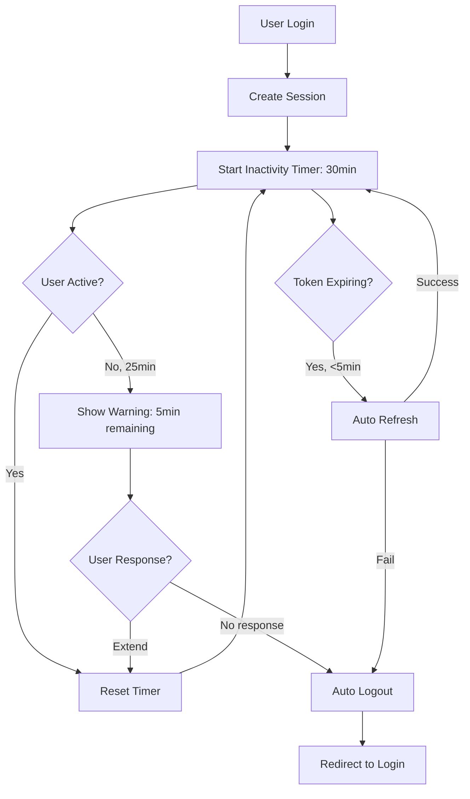

# Session Management Comprehensive Audit & Fixes

## 🔍 Issues Identified

### ❌ **Critical Issues**

1. **Logout doesn't redirect to login page**
   - **Location**: `src/components/shared/Header.tsx` line 553
   - **Current**: `router.push('/')` 
   - **Should be**: `router.push('/login')`
   - **Impact**: Users see homepage instead of login after logout

2. **No session timeout/inactivity detection**
   - **Missing**: Inactivity timeout (industry standard: 15-30 minutes)
   - **Missing**: Idle user detection
   - **Missing**: Session expiration warning
   - **Impact**: Security risk - sessions never expire from inactivity

3. **Token refresh failures not handled properly**
   - **Issue**: If token refresh fails during user activity, no user feedback
   - **Issue**: SIGNED_OUT event doesn't redirect to login
   - **Impact**: User stuck in limbo state

### ⚠️ **Medium Priority Issues**

4. **No "Remember Me" functionality implementation**
   - Login page has "Remember Me" checkbox
   - Not connected to session duration
   - Should affect token persistence

5. **No session info displayed to user**
   - Users don't know when session expires
   - No countdown or warning

6. **Multiple auth state listeners**
   - Could cause memory leaks
   - Not properly cleaned up in some components

### ✅ **What's Good**

- Auto-refresh tokens enabled
- PKCE flow for security
- localStorage persistence
- Proper signOut() implementation
- onAuthStateChange listener

---

## 🎯 Industry Standards for Session Management

### 1. **Session Duration**
- **Active session**: 1-4 hours (with activity)
- **Inactive timeout**: 15-30 minutes of no activity
- **"Remember Me"**: 7-30 days
- **Maximum absolute timeout**: 24 hours (even with activity)

### 2. **Token Management**
- **Access token**: 1 hour expiry
- **Refresh token**: 7-30 days expiry
- **Auto-refresh**: 5 minutes before expiry
- **Refresh on activity**: Reset timer on user actions

### 3. **User Experience**
- **Warning before timeout**: 2-5 minutes before expiry
- **Option to extend**: "Stay logged in?" prompt
- **Graceful logout**: Clear message on expiration
- **Session indicator**: Show time remaining (optional)

### 4. **Security**
- **Secure storage**: HttpOnly cookies for refresh tokens (or localStorage with encryption)
- **CSRF protection**: PKCE flow (already implemented ✅)
- **Single sign-on**: Detect multiple tabs
- **Force logout**: On security events

---

## 🛠️ Fixes to Implement

### Fix 1: Logout Redirect to Login Page
**Priority**: Critical - Immediate fix needed

### Fix 2: Inactivity Timeout System
**Priority**: Critical - Security requirement
- Track last activity time
- Set 30-minute inactivity timeout
- Warn user 5 minutes before timeout
- Auto logout on timeout

### Fix 3: Token Refresh Error Handling
**Priority**: High - User experience
- Detect refresh failures
- Redirect to login with message
- Clear all state properly

### Fix 4: Session Expiration Warning
**Priority**: Medium - User experience
- Show toast 5 minutes before expiry
- Offer "Stay logged in" button
- Countdown timer

### Fix 5: Remember Me Implementation
**Priority**: Medium - Feature completion
- Connect checkbox to session persistence
- Extend session duration if checked
- Store preference

### Fix 6: Better SIGNED_OUT Handling
**Priority**: High - User experience
- Redirect to login on SIGNED_OUT event
- Show logout message
- Don't show error for intentional logout

---

## 📊 Implementation Priority

| Priority | Fix | Est. Time | Impact |
|----------|-----|-----------|--------|
| 🔴 1 | Logout redirect | 5 min | High |
| 🔴 2 | Token refresh error handling | 20 min | High |
| 🔴 3 | SIGNED_OUT redirect | 15 min | High |
| 🟡 4 | Inactivity timeout | 45 min | Medium |
| 🟡 5 | Session warning | 30 min | Medium |
| 🟢 6 | Remember Me | 20 min | Low |
| 🟢 7 | Session indicator | 30 min | Low |

**Total estimated time**: ~2.5 hours

---

## 🎨 Proposed Architecture

```typescript
// Enhanced Session Manager
class SessionManager {
  private lastActivityTime: number;
  private inactivityTimeout: NodeJS.Timeout | null;
  private warningTimeout: NodeJS.Timeout | null;
  private sessionExpiryTime: number | null;
  
  // Track user activity
  trackActivity(): void
  
  // Reset inactivity timer
  resetInactivityTimer(): void
  
  // Show warning before logout
  showExpiryWarning(): void
  
  // Auto logout on inactivity
  autoLogout(): void
  
  // Extend session
  extendSession(): void
  
  // Clean up timers
  cleanup(): void
}
```

---

## 🔄 Proposed Session Flow



---

## 📝 Testing Scenarios

### Scenario 1: Normal Login/Logout
- ✅ Login → Use app → Logout → Redirects to /login
- ✅ Check session cleared from localStorage
- ✅ Check user state cleared

### Scenario 2: Token Refresh
- ✅ Login → Wait for token to near expiry
- ✅ Perform action → Token auto-refreshes
- ✅ No user interruption

### Scenario 3: Inactivity Timeout
- ✅ Login → Don't touch for 25 minutes
- ✅ Warning appears: "Session expiring in 5 minutes"
- ✅ Click "Stay logged in" → Timer resets
- ✅ Don't respond → Auto logout at 30 minutes

### Scenario 4: Token Refresh Failure
- ✅ Simulate refresh failure
- ✅ User sees: "Session expired. Please log in again."
- ✅ Redirects to login page
- ✅ State cleared

### Scenario 5: Remember Me
- ✅ Login with "Remember me" checked → Session lasts 30 days
- ✅ Login without checking → Session lasts 4 hours
- ✅ Inactivity timeout still applies

### Scenario 6: Multiple Tabs
- ✅ Login in Tab 1
- ✅ Open Tab 2 → Already logged in
- ✅ Logout in Tab 1 → Tab 2 also logs out
- ✅ No stale sessions

### Scenario 7: Browser Restart
- ✅ Login with "Remember me"
- ✅ Close browser completely
- ✅ Reopen → Still logged in
- ✅ Session valid until expiry

---

## 🚀 Implementation Roadmap

### Phase 1: Critical Fixes (Now)
- ✅ Fix logout redirect
- ✅ Handle SIGNED_OUT event
- ✅ Improve token refresh error handling

### Phase 2: Security Enhancements (Next)
- ⏳ Implement inactivity timeout
- ⏳ Add session expiration warnings
- ⏳ Better error messages

### Phase 3: UX Improvements (Future)
- ⏳ Session time indicator
- ⏳ "Remember Me" functionality
- ⏳ Multi-tab sync
- ⏳ Session history/audit log

---

## 📚 References

- [OWASP Session Management](https://cheatsheetseries.owasp.org/cheatsheets/Session_Management_Cheat_Sheet.html)
- [Supabase Auth Docs](https://supabase.com/docs/guides/auth)
- [JWT Best Practices](https://datatracker.ietf.org/doc/html/rfc8725)
- [PKCE OAuth Flow](https://oauth.net/2/pkce/)

---

**Next Steps**: Implement Phase 1 critical fixes immediately.

